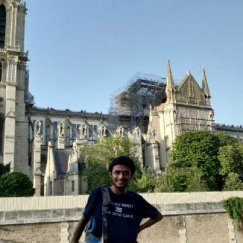

## The Bonn Journal Club on Condendensed Matter Theory \ Physikalisches Institut, Uni Bonn

This page now functions as the archive for the season 1 talks. Other Seasons can be accessed from here.

[Season 1: WiSe22-SoSe23](https://sagnikrg.github.io/CondMat-Bonn/Season-1/)\
[Season 2: WiSe23-SoSe24](https://sagnikrg.github.io/CondMat-Bonn/Season-2/)

**Caution:** 

This page is still being updated from backend to match the new template. Some Links may malfunction.

## Talks This Season:

| Speaker              | Date | Title |
| :---------------- | :------ | :---- |
| **1.** Marvin Lenk (AG Kroha) | October 19, 2022 (Wednesday)| Heavy-Fermion Systems and Some Exotic Examples  |
| | |  [[Slides](https://sagnikrg.github.io/CondMat-Bonn/Season-1/Slides-Marvin.pdf)],[[Abstract](https://sagnikrg.github.io/CondMat-Bonn/Season-1/#abs_marvin)] |
| **2.** Dr. Sayak Ray (AG Kroha) | October 26, 2022 (Wednesday)| Interacting spins under quasiperiodic drive  |
| | |  [[Slides](https://sagnikrg.github.io/CondMat-Bonn/Season-1/Slides-Sayak.pdf)],[[Abstract](https://sagnikrg.github.io/CondMat-Bonn/Season-1/#abs_sayak)] |
| **3.** Dr Anne-Maria Johanna Visuri (AG Kollath) |  November 2, 2022 (Wednesday)| Superfluid transport through a dissipative quantum point contact  |
| | |  [[Slides](https://sagnikrg.github.io/CondMat-Bonn/Season-1/Slides-Anne-Maria.pdf)],[[Abstract](https://sagnikrg.github.io/CondMat-Bonn/Season-1/#abs_anne-maria)] |
| **4.** Philipp Höllmer (AG Monien) |  November 9, 2022 (Wednesday)| Bringing the power of Monte Carlo methods to long-range-interacting molecular systems  |
| | |  [[Slides](https://sagnikrg.github.io/CondMat-Bonn/Season-1/Slides-Philipp.pdf)],[[Abstract](https://sagnikrg.github.io/CondMat-Bonn/Season-1/#abs_philipp)] |
| **5.** Robin Schaefer (MPI-PKS Dresden) | November 21, 2022 (Monday) | The pyrochlore Heisenberg antiferromagnet: From finite to zero temperature |
| | |  [[Slides](https://sagnikrg.github.io/CondMat-Bonn/Season-1/Slides-Robin.pdf)],[[Abstract](https://sagnikrg.github.io/CondMat-Bonn/Season-1/#abs_robin)] |
| **6.** Dr. Franco Thomas Lisandrini (AG Kollath) | December 1, 2022 (Thursday) | Majorana edge-modes in a spinful particle conserving model |
| | |  [[Slides](https://sagnikrg.github.io/CondMat-Bonn/Season-1/Slides-Franco.pdf)],[[Abstract](https://sagnikrg.github.io/CondMat-Bonn/Season-1/#abs_franco)] |
| **7.** Sagnik Ghosh (AG Luitz) |  December 8, 2022 (Thursday) | Absorbing State Transitions in Monitored Systems |
| | |  [[Slides]()],[[Abstract](https://sagnikrg.github.io/CondMat-Bonn/Season-1/#abs_sagnik)] |
| **8.** Michael Kajan (AG Kroha) | December 14, 2022 (Wednesday) | Methods for Slave-Particles in Non-Equilibrium |
| | |  [[Slides](https://sagnikrg.github.io/CondMat-Bonn/Season-1/Slides-Robin.pdf)],[[Abstract](https://sagnikrg.github.io/CondMat-Bonn/Season-1/#abs_micha)] |
| **9.** Prof. David Luitz | February 1, 2023 (Wednesday) | TFast Time-Evolution of Matrix-Product States using the QR decomposition |
| | |  [[Slides](https://sagnikrg.github.io/CondMat-Bonn/Season-1/Slides-Robin.pdf)],[[Abstract](https://sagnikrg.github.io/CondMat-Bonn/Season-1/#abs_robin)] |
| **10.** Maxime Debertolis (AG Luitz) | February 8, 2023 (Wednesday) | Study of quantum impurity problems in the framework of natural orbitals |
| | |  [[Slides](https://sagnikrg.github.io/CondMat-Bonn/Season-1/Slides-Robin.pdf)],[[Abstract](https://sagnikrg.github.io/CondMat-Bonn/Season-1/#abs_robin)] |
| **11.** Prof. Lena Funcke  | February 16, 2023 (Thursday) | Towards overcoming the sign problem with tensor networks and quantum computing |
| | |  [[Slides](https://sagnikrg.github.io/CondMat-Bonn/Season-1/Slides-Robin.pdf)],[[Abstract](https://sagnikrg.github.io/CondMat-Bonn/Season-1/#abs_robin)] |
| **12.** Dr. Neda Ahamadi (AG Kollath) | February 22, 2023 (Wednesday) | Dissipative symmetry-protected topological order |
| | |  [[Slides](https://sagnikrg.github.io/CondMat-Bonn/Season-1/Slides-Robin.pdf)],[[Abstract](https://sagnikrg.github.io/CondMat-Bonn/Season-1/#abs_robin)] |
| **13.** Prof. Dr. Johann Kroha | April 11, 2023 (Tuesday) | Kondo breakdown in Kondo lattice systems: RKKY versus local spin screening, or: How to measure Eulers constant |
| | |  [[Slides](https://sagnikrg.github.io/CondMat-Bonn/Season-1/Slides-Robin.pdf)],[[Abstract](https://sagnikrg.github.io/CondMat-Bonn/Season-1/#abs_robin)] |
| **14.** Prof. Tom C. Luu (Julich) | April 18, 2023 (Tuesday) | Alleviating the Sign Problem via Contour Deformation |
| | |  [[Slides](https://sagnikrg.github.io/CondMat-Bonn/Season-1/Slides-Robin.pdf)],[[Abstract](https://sagnikrg.github.io/CondMat-Bonn/Season-1/#abs_robin)] |
| **15.** Martina Gisti (AG Luitz) | May 23, 2023 (Tuesday) | Isometric Tensor Network states in 2dquantum many-body systems as representations of thermal states |
| | |  [[Slides](https://sagnikrg.github.io/CondMat-Bonn/Season-1/Slides-Robin.pdf)],[[Abstract](https://sagnikrg.github.io/CondMat-Bonn/Season-1/#abs_robin)] |
| **17.** Karin Haderlein (AG Kollath) |  May 09, 2023 (Tuesday) | TSpectral Properties of the Dimerized Fermi Hubbard Model |
| | |  [[Slides](https://sagnikrg.github.io/CondMat-Bonn/Season-1/Slides-Robin.pdf)],[[Abstract](https://sagnikrg.github.io/CondMat-Bonn/Season-1/#abs_robin)] |
| **18.** Prof. Carsten Urbach | May 23, 2023 (Tuesday) | Hamiltonian approach to lattice gauge theories with digitised gauge fields |
| | |  [[Slides](https://sagnikrg.github.io/CondMat-Bonn/Season-1/Slides-Robin.pdf)],[[Abstract](https://sagnikrg.github.io/CondMat-Bonn/Season-1/#abs_robin)] |

## Details of Talks:

**1. October 19, 2022**

 

**Title:** Heavy-Fermion Systems and Some Exotic Examples 

**Speaker:** Marvin Lenk (AG Kroha)

**Abstract:**

   
In this talk I will discuss the physics of heavy-fermion systems and my current research in this field, including topological systems and exotic effects in this category. Starting from simple concepts in condensed matter theory and quantum mechanics, I will briefly explain the origin of the Kondo effect and how heavy Kondo-bands can form in real-world alloys. In that context, dynamical mean-field theory (DMFT) and the non-crossing approximation (NCA) will be briefly discussed as methods to numerically solve such systems. Finally, I will present results of applying these methods to solve bulk topological Kondo-insulators like SmB6 and the quadrupolar two-channel Kondo effect in PrV2Al20.

Indico Link: [https://indico.hiskp.uni-bonn.de/event/146/](https://indico.hiskp.uni-bonn.de/event/146/)

[[Slides](https://sagnikrg.github.io/CondMat-Bonn/Season-1/Slides-Marvin.pdf)],
[[Poster](https://sagnikrg.github.io/CondMat-Bonn/Season-1/JC-Poster.pdf)]

**2. October 26, 2022**

**Title:** Interacting spins under quasiperiodic drive

**Speaker:** Dr. Sayak Ray (AG Kroha)

**Abstract:** 

   
In this talk, I will discuss the dynamics of a system subjected to quasiperiodic drive. As a toy model, I will consider a spin-S object subjected to \delta-function kicks which are applied in the transverse direction of the magnetic field and generated from a Fibonacci sequence. In the large spin classical limit, the phase space appears to be chaotic; interestingly, however, the Lyapunov exponent turns out to be zero and thus the dynamics remain phase-coherent. I will show that such dynamics are similar to a strange non-chaotic attractor with fractal nature which is also present in the Floquet eigenstates. Interaction with another spin results in ergodic dynamics leading to infinite temperature thermalization.

Indico Link: [https://indico.hiskp.uni-bonn.de/event/148/](https://indico.hiskp.uni-bonn.de/event/148/)

[[Slides](https://sagnikrg.github.io/CondMat-Bonn/Season-1/Slides-Sayak.pdf)]

**3. November 2, 2022**

**Title:** Superfluid transport through a dissipative quantum point contact

**Speaker:**  Dr Anne-Maria Johanna Visuri (AG Kollath)

**Abstract:** 

   
We study theoretically and experimentally the superfluid transport of ultracold fermionic atoms through a quantum point contact with a local particle loss. In the absence of losses, superconducting contacts are known to exhibit multiple Andreev reflections - a high-order cotunneling of a quasiparticle together with multiple Cooper pairs - which gives rise to a current at chemical potential biases below the energy gap. We develop a model the lossy quantum point contact where the superfluid reservoirs are connected via tunneling to a dissipative site, and interactions are taken into account in a mean-field approximation. We compute nonequilibrium observables using the Keldysh formalism and find that the current generated by the seemingly delicate high-order tunneling process is surprisingly robust to particle losses. This result  agrees with experimental data: we apply a pair-breaking, spin-dependent dissipation at the contact and observe that the characteristic non-Ohmic superfluid transport survives even at dissipation strength larger than the superfluid gap [1].

[1] M.-Z. Huang et al., arXiv:2210.03371

Indico Link: [https://indico.hiskp.uni-bonn.de/event/156/](https://indico.hiskp.uni-bonn.de/event/156/)

[[Poster](https://sagnikrg.github.io/CondMat-Bonn/Season-1/JC-Poster-Anne-Maria-min.pdf)]
[[Slides](https://sagnikrg.github.io/CondMat-Bonn/Season-1/Slides-Anne-Maria.pdf)]

**4. November 9, 2022**

 

**Title:** Bringing the power of Monte Carlo methods to long-range-interacting molecular systems

**Speaker:**  Philipp Höllmer (AG Monien)

**Abstract:** 

   
Molecular simulations are widespread in molecular sciences to study, e.g., protein folding. Here, chemical systems are modeled empirically by a set of atomic positions with parameterized interaction potentials. Nowadays, molecular-dynamics (MD) simulations are predominantly used to study long-range-interacting molecular systems because of their superior computational complexities and Newtonian dynamics when compared to traditional Markov-chain Monte Carlo (MCMC) simulations. We argue that both disadvantages of traditional reversible MCMC are overcome by event-chain Monte Carlo (ECMC), which is a family of non-reversible MCMC methods.

In this talk, we will explore how ECMC samples the equilibrium Boltzmann distribution exactly, although it uses non-equilibrium dynamics and never computes the total system potential. We will discuss how ECMC's sole restriction of the global-balance condition yields a great freedom to implement quickly decorrelating dynamics beyond Newtonian's dynamics of MD. This freedom is evidenced by various variants of ECMC that show widely different performances depending on the specific use case. Finally, we will demonstrate O(N log N) scaling for ECMC's decorrelation of an N-body system of a commonly used long-range-interacting water model. This matches the performance of MD without ever discretizing time or space.

Collaborators: N. Noirault (ENS Paris), B. Li (ENS Paris), A. C. Maggs (ESPCI Paris), W. Krauth (ENS Paris)

Indico Link: [https://indico.hiskp.uni-bonn.de/event/159/](https://indico.hiskp.uni-bonn.de/event/159/)

[[Poster](https://sagnikrg.github.io/CondMat-Bonn/Season-1/JC-Poster-Philipp-min.pdf)]
[[Slides](https://sagnikrg.github.io/CondMat-Bonn/Season-1/Slides-Philipp.pdf)]

**5. November 21, 2022 (Monday)**

 

**Title:** The pyrochlore Heisenberg antiferromagnet: From finite to zero temperature

**Speaker:**  Robin Schaefer (MPI-PKS Dresden)

**Abstract:** 

   

Frustrated magnets realize exotic forms of quantum matter beyond conventional order. However, many questions remain unanswered due to a lack of controlled and unbiased methods to study frustration in three dimensions. While most established numerical techniques have limited applicability, approaches based on cluster expansions are promising alternatives revealing novel insights into an archetypal problem of frustrated magnetism in three dimensions: the pyrochlore Heisenberg antiferromagnet. For the first time, we are able to unbiasedly resolve its thermodynamic quantities to a temperature far beyond the scale on which the Schottky anomaly occurs. The broad applicability of the numerical linked cluster algorithm allows for the systematic investigation of different spin-liquid candidate materials such as the Cerium-based pyrochlores Ce2Zr2O7 and Ce2Sn2O7.

Despite a similar chemical composition, the algorithm finds fundamental differences in their quantum mechanical nature by constraining their microscopic exchange parameters.

Zero temperature properties are even less accessible: Neither the nature of the ground state nor an estimate of its energy are known for the pyrochlore antiferromagnet. Large-scale density matrix renormalization group calculations pushed to three dimensions provide the first reliable estimate of its ground-state energy and yield robust evidence for a spontaneous inversion symmetry breaking manifesting itself as an energy density difference on the tetrahedral sublattice. The symmetry-breaking tendency of the model is further observed in the presence of an external magnetic field where similar calculations suggest a stable 1/2-magnetization plateau. Continuing the investigation of low-energy states, we propose a new family  -- exponentially numerous in the linear system size -- of valence-bond crystals as potential ground states. Understanding the stability of the previously overlooked family of states suggests a remarkable change of perspective on frustration with a focus on unfrustrated motifs, which are effectively uncoupled by the frustration. They can be visualized as hard-hexagon coverings, with each hexagon representing a resonating valence-bond ring breaking rotation, inversion, and translation symmetries spontaneously.

Indico Link: [https://indico.hiskp.uni-bonn.de/event/171/](https://indico.hiskp.uni-bonn.de/event/171/)

[[Poster](https://sagnikrg.github.io/CondMat-Bonn/Season-1/JC-Poster-Robin-min.pdf)]

**6. December 1, 2022 (Thursday)**

 

**Title:** Majorana edge-modes in a spinful particle conserving model

**Speaker:**   Dr. Franco Thomas Lisandrini (AG Kollath)

**Abstract:** 

   

Topologically protected edge states, such as Majorana edge modes, have attracted a lot of attention over the past. The interest in Majorana modes is motivated by curiosity to observe and understand these fundamental quasi-particles, but also by the key role such modes play in several quantum information protocols. One important model which covers Majorana zero modes was proposed by Kitaev in 2001. It consists of a single chain of spinless fermions where the number of fermions in the system is not conserved. In spinless systems, people found that ground states supporting Majorana edge modes are present also in particle-number conserving settings. In this talk we will show the presence of Majorana edge modes in an interacting fermionic ladder with spin in a number conserved setting. The main result of the present work is that the topological phase is robust for a finite region in the parameter space in the presence of interactions.

Indico Link: [https://indico.hiskp.uni-bonn.de/event/189/](https://indico.hiskp.uni-bonn.de/event/189/)

[[Poster](https://sagnikrg.github.io/CondMat-Bonn/Season-1/JC-Poster-Franco-min.pdf)]
[[Slides](https://sagnikrg.github.io/CondMat-Bonn/Season-1/Slides-Franco.pdf)]

**7. December 8, 2022 (Thursday)**

 

**Title:** Absorbing State Transitions in Monitored Systems

**Speaker:**  Sagnik Ghosh (AG Luitz)

**Abstract:** 

   

In this talk I will start with briefly reviewing the recent literature on the phenomena of Measurement Induced Phase Transitions in Unitary systems punctuated with projection operators. The criticality in these systems is however only visible in particular trajectories and the ensemble averaged density matrix is featureless and often maximally scrambled. This makes their experimental realization exponentially difficult, as one ought to build an ensemble of the exact measurement realizations, dimensions of which scales exponentially, a problem which is formally known as post-selection. With these foundations, in the remainder I will discuss a last week Arxiv paper by Vedika Khemani et. al. that attempts to find an alternate absorbing criticality in the punctuated systems that does not suffer from post selection and hence is claimed to be a more suitable candidate for experimental realization.

 
 
 
 

Reference: Entanglement and Absorbing-State Transitions in Interactive Quantum Dynamics.
O'Dea N, Morningstar A, Gopalakrishnan S, Khemani V.
ArXiv:2211.12526. (22 Nov 2022.)

Indico Link: [https://indico.hiskp.uni-bonn.de/event/190/](https://indico.hiskp.uni-bonn.de/event/190/)

Slides:

<iframe src="https://slides.com/sagnikghosh-1/numerical-models-in-cond-mat-physics-267d5a/embed" width="576" height="420" title="Absorbing Transitions" scrolling="no" frameborder="0" webkitallowfullscreen mozallowfullscreen allowfullscreen></iframe>

**8. December 14, 2022 (Wednesday)**

  

**Title:** Methods for Slave-Particles in Non-Equilibrium

**Speaker:**  Michael Kajan (AG Kroha)

**Abstract:** 

   

The generall description of non-equilibrium system in a QFT framework has been known for quite some time now [Keldysh 64, Schwinger 61, Feynman Vernon 63] but its application were rather limited due to computational cost and experimental relevance. In the last few decades interest was sparked again due to experimental advances in open and driven quantum system. We will give here an introduction to the framework of the Schwinger-Keldysh formalism in an Green function approach.

We focus on bosonic systems, which may show spontaneously broken symmetry requiring anself consistent approximation scheme. To this end we will introduce the 2-PI effective action [Cornwall, Jackiw, Tomboulis 74] [Berges 05]. As an example system we consider dye-molecules coupled to cavity photons using a slave-particle method, which has been used as impurity solver in heavy fermion systems for quite some time now [Coleman 84]. We show how their concept can be extended to a wide range of physical systems and implemented in an non-equilibrium framework.

Indico Link: [https://indico.hiskp.uni-bonn.de/event/198/](https://indico.hiskp.uni-bonn.de/event/198/)

[[Poster](https://sagnikrg.github.io/CondMat-Bonn/JC-Poster-Micha-min.pdf)]

**9. February 1, 2023 (Wednesday)**

 
**Title:** Fast Time-Evolution of Matrix-Product States using the QR decomposition

**Speaker:** Prof. David Luitz

**Abstract:** 

   

This talk discusses the following paper by Jakob Unfried, Johannes Hauschild, and Frank Pollmann. The abstract of the same is attached below.

 

Link to paper: https://arxiv.org/abs/2212.09782

 

Abstract from the paper:

We propose and benchmark a modified time evolution block decimation (TEBD) algorithm that uses a truncation scheme based on the QR decomposition instead of the singular value decomposition (SVD). The modification reduces the scaling with the dimension of the physical Hilbert space d from d3 down to d2. Moreover, the QR decomposition has a lower computational complexity than the SVD and allows for highly efficient implementations on GPU hardware. In a benchmark simulation of a global quench in a quantum clock model, we observe a speedup of up to three orders of magnitude comparing QR and SVD based updates on an A100 GPU.

 

Indico Link: [https://indico.hiskp.uni-bonn.de/event/251](https://indico.hiskp.uni-bonn.de/event/251/)

**10. February 8, 2023 (Wednesday)**

 

**Title:** Study of quantum impurity problems in the framework of natural orbitals

**Speaker:**  Maxime Debertolis (AG Luitz)

**Abstract:** 

   

I will present the work of my PhD thesis, in which quantum impurity problems are tackled with the use of natural orbitals, a representation rooted in the framework of quantum chemistry. From the inherent simplicity of these problems under this representation, a new algorithm is developed to generate an optimized few-body wavefunction, which surpasses usual ground state computations. In the first place, the algorithm is used to compute the screening cloud in large one-dimensional chains and in a 2D square lattice coupled to a localized atom. Then, a statistical study on large systems is performed, in which the the fate of the correlation cloud spreading into the disordered electronic bath is investigated.

 

Indico Link: [https://indico.hiskp.uni-bonn.de/event/258](https://indico.hiskp.uni-bonn.de/event/258/)

**11. February 16, 2023 (Thursday)**

 

**Title:** Towards overcoming the sign problem with tensor networks and quantum computing

**Speaker:**  Prof. Lena Funcke 

**Abstract:** 

   

In this talk, I will discuss recent advances towards overcoming the sign problem of Monte Carlo simulations. There are several parameter regimes of lattice quantum field theory that cannot be simulated with conventional Monte Carlo methods, including topological terms, non-zero baryon density, and real-time dynamics. At the example of (1+1)-dimensional benchmark models, I will discuss new directions towards overcoming these problems, based on tensor networks and quantum computing. Finally, I will comment on the requirements to integrate these methods into (3+1)-dimensional lattice simulations in the future, focusing on Lattice QCD.

 

Indico Link: [https://indico.hiskp.uni-bonn.de/event/256](https://indico.hiskp.uni-bonn.de/event/256/)

 **12. February 22, 2023 (Wednesday)**

 

**Title:** Dissipative symmetry-protected topological order

**Speaker:**  Dr. Neda Ahamadi (AG Kollath)

**Abstract:** 

   

In this work, we investigate the interplay between dissipation and symmetry-protected topological order. We considered the one-dimensional Spin-1 Affleck-Kennedy-Lieb-Tasaki model interacting with an environment where the dissipative dynamics are described by the Lindladian master equation. The Markovian dynamics is solved by the implementation of a tensor-network algorithm for mixed states in the thermodynamic limit. We observe that, for time-reversal symmetric dissipation, the resulting steady state has topological signatures even if being a mixed state. This is seen in finite string-order parameters as well as in the degeneracy pattern of singular values in the tensor network decomposition of the reduced density matrix. We also show that such features do not appear for non-symmetric dissipation. Our work opens the way toward a generalized and more practical definition of symmetry-protected topological order for mixed states induced by dissipation.

​

​Arxiv Link: https://arxiv.org/abs/2211.14389

 

Indico Link: [https://indico.hiskp.uni-bonn.de/event/257](https://indico.hiskp.uni-bonn.de/event/257/)

**13. April 11, 2023 (Tuesday)**

 
**Title:** Kondo breakdown in Kondo lattice systems: RKKY versus local spin screening,
or: How to measure Eulers constant

**Speaker:**  Prof. Dr. Johann Kroha

**Abstract:** 

 

   

 The RKKY interaction is a coupling between magnetic impurities in a metal mediated over large distances by the conduction electrons. Its interplay with the local Kondo spin singlet formation can induce quantum phase transitions (QPT) from a heavy Fermi liquid to magnetically ordered phases. However, the RKKY interaction has escaped a systematical treatment due to its indirect, long-range nature. In this talk we discuss an analytic 1-loop renormalization group (RG ) treatment of Kondo breakdown under the influence of the RKKY interaction. Its long-range nature is self-consistently incorporated in the RG in the spirit of a dynamical mean-field theory. The theory predicts a universal suppression of the Kondo scale at the QPT in agreement with experiments on two-impurity Kondo systems. It suggests a rather complicated way for "measuring" Euler's constant.

**14. April 18, 2023 (Tuesday)**

 
**Title:** Alleviating the Sign Problem via Contour Deformation

**Speaker:**  Prof. Tom C. Luu (Julich)

**Abstract:** 

 

   
I discuss my current research in using contour deformations to alleviate the numerical sign problem in stochastic simulations.  I consider deformations of various forms, ranging from simple constant offsets to those that approximate so-called Lefschetz thimbles--high-dimensional manifolds that have, in principle, no sign problem.  In the latter case I show how machine learning can be used to approximate such manifolds.  I apply these deformations to investigate low-D doped Hubbard model in various geometries.

**15. May 23, 2023 (Tuesday)**

**Title:**  Isometric Tensor Network states in 2dquantum many-body systems as representations of thermal states.

**Speaker:**  Martina Gisti (AG Luitz)

**Abstract:** 

 

   
Tensor Network states (TNS) are effective representations of states describing low-dimensional complex many-body systems. In one-dimensional systems these variational states are successfully used in many algorithms, but in two dimensions it becomes difficult to exploit them to elaborate efficient algorithms.In this talk, a particular class of recently introduced isometric TNS (isoTNS) will be presented, through which successful numerical implementations are realized. As an interesting application, I will discuss recent results showing how to efficiently represent finite temperature states with isoTNS with low computational complexity.

 

**17. May 09, 2023 (Tuesday)**

 
**Title:**  Spectral Properties of the Dimerized Fermi Hubbard Model

**Speaker:**  Karin Haderlein (AG Kollath)

**Abstract:** 

 

   
In this talk I am going to present the topic of my master thesis. By examining the properties of a model’s level statistics we are able to conclude whether we can expect the system to thermalize or not. For this a thorough understanding of the underlying symmetries of the model is necessary. Therefore, we discuss the symmetries of the dimerized Fermi Hubbard model and how to generate its spectrum divided into symmetry sectors using exact diagonalization. The resulting properties of the level statistics are analysed for different parameters of the model where we find GOE characteristics in all expected symmetry subsectors. Thus, the dimerized Fermi Hubbard model is expected to be thermalized.

**18. May 23, 2023 (Tuesday)**

 
**Title:**  Hamiltonian approach to lattice gauge theories with digitised gauge fields

**Speaker:**  Prof. Carsten Urbach

**Abstract:** 

 

   With the advent of quantum computing and rapidly developing tensor
network methods also the simulation of quantum chromodynamics with
such technologies comes into reach. This requires the restriction of
the well known Kogut-Susskind Hamiltonian for lattice gauge theories
to a finite dimensional Hilbert space, which can be achieved by
digitising the gauge fields. In this presentation we discuss one
approach for doing so for the gauge group SU(2) based on partitionings
of the gauge group.

 

   TBA

**20. June 13, 2023 (Tuesday)**

 
**Title:**  TBA

**Speaker:**  Dr. Andrea Bergschneider

**Abstract:** 

 

   TBA

# Past Talks

 

**Link for Zulip:**

[https://condmat-bonn.zulipchat.com](https://condmat-bonn.zulipchat.com/)

